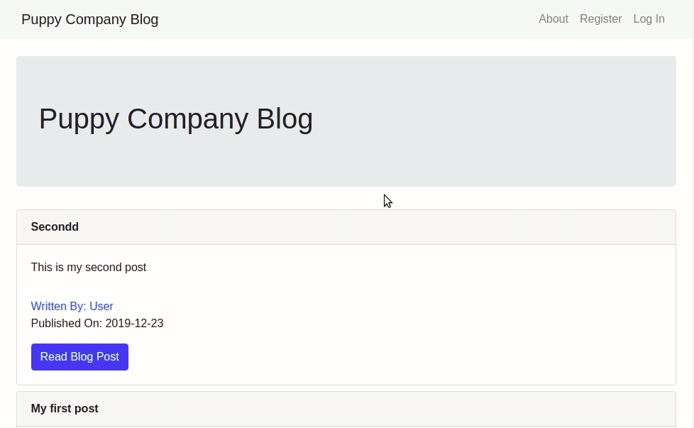

<h1 align="center">
	Python Flask Example
</h1>

Puppy Company Blog is a simple example of my learning in Flask.



---


## Technologies

-   [Python 3.7.4](https://www.python.org/)
-   [Flask 1.0.2](https://palletsprojects.com/p/flask/)
-   [Anaconda 4.7.12](https://www.anaconda.com/)
-   [SQLite 3.30.0](https://www.sqlite.org/index.html)
-   [Bootstrap 4.4.1](https://getbootstrap.com/)

## Run

```bash
# After clone the project
$ cd flask_example

# Install packages
$ pip install -r requirements.txt

# Set up migrations
$ flask db init
$ flask db migrate
$ flask db upgrade

# Run the app
$ python app.py

```  
The application will be available at: *http://127.0.0.1:5000/*
